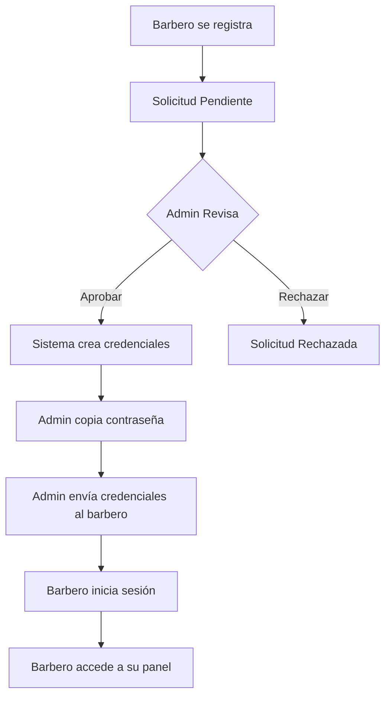

# 🔐 Guía: Generación de Credenciales para Barberos

## 📋 Índice
1. [Flujo Actual (Solicitudes)](#flujo-actual-solicitudes)
2. [Crear Barbero Directamente (Nueva Funcionalidad)](#crear-barbero-directamente)
3. [Gestionar Credenciales Existentes](#gestionar-credenciales-existentes)
4. [Recuperación de Contraseñas](#recuperación-de-contraseñas)
5. [Permisos y Roles](#permisos-y-roles)

---

## 1️⃣ Flujo Actual (Solicitudes)

### **Método Recomendado**: Aprobar Solicitudes de Barberos

Este es el flujo estándar y más seguro para agregar nuevos barberos:

### **Paso 1: El Barbero se Registra**
1. El barbero visita: `https://chamosbarber.com/registro-barbero`
2. Completa el formulario con:
   - Nombre completo
   - Email (será su usuario)
   - Teléfono
   - Especialidades
   - Experiencia
   - Biografía
3. Envía la solicitud

### **Paso 2: Revisar Solicitudes (Panel Admin)**
1. Inicia sesión en el panel admin: `https://chamosbarber.com/admin`
2. Ve a la pestaña **"Solicitudes"**
3. Verás todas las solicitudes pendientes con:
   - ✅ **Nombre del barbero**
   - ✅ **Email de contacto**
   - ✅ **Teléfono**
   - ✅ **Especialidades**
   - ✅ **Años de experiencia**
   - ✅ **Biografía**
   - ✅ **Estado**: Pendiente/Aprobada/Rechazada

### **Paso 3: Aprobar Solicitud**
1. Click en el botón **"Aprobar"** de la solicitud deseada
2. Se abre un modal de confirmación
3. El sistema automáticamente:
   - ✅ **Crea cuenta de usuario** en Supabase Auth
   - ✅ **Genera contraseña segura** automáticamente
   - ✅ **Crea registro en tabla `barberos`**
   - ✅ **Crea usuario en `admin_users`** con rol 'barbero'
   - ✅ **Actualiza estado de solicitud** a 'aprobada'
   - ✅ **Muestra la contraseña generada** en el modal

### **Paso 4: Entregar Credenciales al Barbero**
Después de aprobar, el sistema muestra:

```
✅ Barbero aprobado exitosamente!

📧 Email: barbero@ejemplo.com
🔑 Contraseña: ChamosAbc123!xyz4

⚠️ IMPORTANTE: Guarda estas credenciales de forma segura.
Esta es la única vez que verás la contraseña.

El barbero puede iniciar sesión en:
🔗 https://chamosbarber.com/login
```

**IMPORTANTE**: 
- ⚠️ **Copia la contraseña inmediatamente**
- ⚠️ **Envíala al barbero por un canal seguro** (WhatsApp, email, etc.)
- ⚠️ **No podrás ver la contraseña nuevamente**

### **Credenciales Generadas**
El formato de la contraseña es:
```
Chamos + 8 caracteres aleatorios + ! + 4 caracteres timestamp
Ejemplo: ChamosAbc12345!xyz4
```

- ✅ Mínimo 16 caracteres
- ✅ Incluye mayúsculas, minúsculas, números
- ✅ Incluye caracteres especiales (!)
- ✅ Única y segura

---

## 2️⃣ Crear Barbero Directamente (Nueva Funcionalidad)

### **Método Alternativo**: Crear desde el Panel Admin

Si necesitas agregar un barbero sin pasar por el flujo de solicitud:

### **Paso 1: Ir a la Pestaña "Barberos"**
1. En el panel admin: `https://chamosbarber.com/admin`
2. Click en la pestaña **"Barberos"**

### **Paso 2: Crear Nuevo Barbero**
1. Click en el botón **"+ Crear Barbero"**
2. Completa el formulario:
   - **Nombre**: Nombre del barbero
   - **Apellido**: Apellido del barbero
   - **Email**: Email único (será su usuario de login)
   - **Teléfono**: Número de WhatsApp
   - **Biografía**: Descripción profesional
   - **Especialidades**: Seleccionar del dropdown
   - **Porcentaje Comisión**: % que recibe por servicios
   - **Imagen**: URL de foto de perfil
   - **Activo**: ✅ (debe estar marcado)

### **Paso 3: Opción de Credenciales**
Al crear el barbero, puedes elegir:

**Opción A**: Solo crear perfil (sin credenciales)
- Crea el perfil en la tabla `barberos`
- No crea usuario de login
- Útil para barberos que no necesitan acceso al panel

**Opción B**: Crear perfil + credenciales de acceso
- Crea el perfil en `barberos`
- Crea usuario en Supabase Auth
- Genera contraseña automática
- Crea entrada en `admin_users` con rol 'barbero'

### **Paso 4: Obtener Credenciales**
Si elegiste crear con credenciales:
1. El sistema muestra un modal con:
   - Email de acceso
   - Contraseña generada
   - Link de login
2. **Copia y envía las credenciales al barbero**

---

## 3️⃣ Gestionar Credenciales Existentes

### **Ver Barberos con Acceso**
En la pestaña **"Barberos"**:
- 🟢 **Icono de usuario verde**: Tiene credenciales de acceso
- ⚪ **Icono de usuario gris**: Solo perfil, sin acceso al sistema

### **Activar/Desactivar Acceso**
1. En la lista de barberos
2. Toggle del switch **"Activo"**
   - ✅ **ON**: Barbero puede iniciar sesión
   - ❌ **OFF**: Barbero deshabilitado (no puede entrar)

### **Editar Información del Barbero**
1. Click en el botón **"Editar"** (icono de lápiz)
2. Modifica los datos necesarios:
   - Nombre, apellido, biografía
   - Especialidades
   - Porcentaje de comisión
   - Imagen de perfil
3. Click en **"Guardar"**

**NOTA**: No puedes cambiar el email desde el panel (es el identificador único)

---

## 4️⃣ Recuperación de Contraseñas

### **Problema**: Barbero olvidó su contraseña

### **Solución 1: Reset desde el Panel Admin**

**🔨 PENDIENTE DE IMPLEMENTAR** - Función de "Reset Password"

Por ahora, usa la Solución 2.

### **Solución 2: Reset Manual (Actual)**

1. **Opción A - Desactivar y Crear Nueva Cuenta**:
   - Desactiva el barbero actual
   - Crea un nuevo perfil con un email diferente
   - Genera nuevas credenciales
   - **Desventaja**: Pierde historial

2. **Opción B - Usar Supabase Dashboard**:
   - Ve a Supabase Dashboard: `https://supabase.chamosbarber.com`
   - Authentication > Users
   - Busca el email del barbero
   - Click en el usuario > "Send password reset email"
   - El barbero recibirá un email para resetear

3. **Opción C - API de Reset** (Recomendado):
   ```bash
   # Endpoint para implementar
   POST /api/auth/reset-password
   Body: { email: "barbero@ejemplo.com" }
   ```

---

## 5️⃣ Permisos y Roles

### **Rol: Barbero**
Un barbero con credenciales puede:
- ✅ Ver su panel personal: `/barbero-panel`
- ✅ Ver sus citas asignadas
- ✅ Ver su calendario de disponibilidad
- ✅ Ver sus comisiones ganadas
- ✅ Editar su perfil (biografía, foto)
- ❌ **NO puede** acceder al panel admin completo
- ❌ **NO puede** crear/editar otros barberos
- ❌ **NO puede** ver finanzas globales

### **Rol: Admin**
Un administrador puede:
- ✅ Acceso completo al panel admin
- ✅ Gestionar barberos (crear, editar, desactivar)
- ✅ Aprobar/rechazar solicitudes
- ✅ Ver todas las citas
- ✅ Ver finanzas y comisiones
- ✅ Configurar servicios, horarios, etc.

### **Verificación de Roles**
El sistema verifica el rol en cada página:
- `/admin`: Solo usuarios con rol 'admin'
- `/barbero-panel`: Solo usuarios con rol 'barbero'
- `/login`: Público

---

## 🔄 Flujo Completo: Nuevo Barbero



---

## 📝 Checklist: Agregar Nuevo Barbero

### **Antes de Aprobar**
- [ ] Verificar email válido y único
- [ ] Revisar experiencia y especialidades
- [ ] Validar identidad del barbero (contacto previo)
- [ ] Confirmar que necesita acceso al sistema

### **Durante la Aprobación**
- [ ] Click en "Aprobar" en la solicitud
- [ ] **Copiar la contraseña generada inmediatamente**
- [ ] Anotar email + contraseña de forma segura

### **Después de Aprobar**
- [ ] Enviar credenciales al barbero (WhatsApp/Email)
- [ ] Confirmar que el barbero recibió las credenciales
- [ ] Pedir al barbero que inicie sesión y cambie su contraseña
- [ ] Verificar que el barbero aparece activo en la pestaña "Barberos"
- [ ] Configurar su comisión si es diferente al estándar

---

## 🛠️ Mejoras Futuras (Roadmap)

### **Funcionalidades Pendientes**
1. ✅ **Botón "Reset Password" en panel admin**
   - Admin puede resetear contraseña de barbero
   - Genera nueva contraseña automática
   - Muestra en modal para copiar

2. ✅ **Envío automático de credenciales por email**
   - Al aprobar, sistema envía email al barbero
   - Incluye usuario, contraseña y link de login
   - Requiere configurar servicio de email (SendGrid, etc.)

3. ✅ **Cambio de contraseña desde panel barbero**
   - Barbero puede cambiar su propia contraseña
   - Desde su panel `/barbero-panel`
   - Requiere contraseña actual para seguridad

4. ✅ **Crear barbero con credenciales desde "Crear Barbero"**
   - Checkbox: "Crear con acceso al sistema"
   - Genera credenciales automáticamente
   - Muestra en modal para copiar

5. ✅ **Log de actividad de barberos**
   - Ver último login
   - Historial de cambios de perfil
   - Acciones realizadas

---

## 🚨 Seguridad

### **Buenas Prácticas**
1. ✅ **Nunca** compartas contraseñas por canales inseguros
2. ✅ **Siempre** verifica la identidad antes de aprobar
3. ✅ **Desactiva** inmediatamente barberos que ya no trabajan
4. ✅ **Revisa** periódicamente los usuarios activos
5. ✅ **Usa** contraseñas únicas y seguras

### **En Caso de Compromiso**
Si sospechas que una cuenta fue comprometida:
1. **Desactiva** el barbero inmediatamente (toggle OFF)
2. **Elimina** el usuario en Supabase Auth si es necesario
3. **Crea** una nueva cuenta con email diferente
4. **Notifica** al barbero de la situación

---

## 📞 Soporte

Si tienes problemas con credenciales:
1. Verifica que el barbero está **Activo** en la pestaña Barberos
2. Confirma que el email es correcto
3. Revisa los logs de Supabase para errores de autenticación
4. Si persiste, contacta al desarrollador

---

**Última actualización**: 2025-12-15  
**Versión del sistema**: 2.0  
**Commit**: Pendiente de deploy
