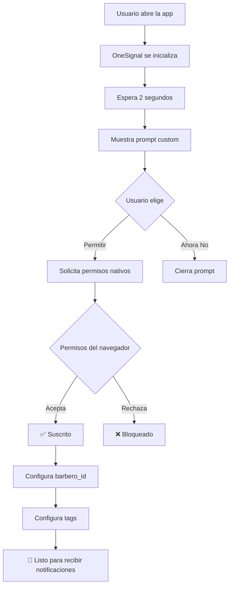

# 🚀 OneSignal - Guía Rápida de Pruebas

## ✅ ¿Qué se implementó?

### 1. **Inicialización Automática**
```typescript
// En _app.tsx
<OneSignalProvider autoPrompt={true}>
  {/* Tu app */}
</OneSignalProvider>
```
- ✅ Se inicializa al cargar la aplicación
- ✅ Usa `NEXT_PUBLIC_ONESIGNAL_APP_ID`
- ✅ App ID: `63aa14ec-de8c-46b3-8949-e9fd221f8d70`

### 2. **Solicitud Automática de Permisos** ⭐
```typescript
// Auto-prompt después de 2 segundos
setTimeout(() => {
  setShowPrompt(true)
}, 2000)
```
- ✅ Aparece automáticamente 2 segundos después de cargar
- ✅ Diseño custom dark/gold
- ✅ Botones: "Permitir Notificaciones" y "Ahora No"

### 3. **Panel de Debug** 🔧
- ✅ Botón flotante dorado (esquina inferior derecha)
- ✅ Solo visible en modo desarrollo
- ✅ Muestra todo el estado de OneSignal

## 🧪 Cómo Probar (3 Pasos)

### Paso 1: Iniciar el Servidor
```bash
cd /home/user/webapp
npm run dev
```

### Paso 2: Abrir en el Navegador
```
http://localhost:3000
```

### Paso 3: Aceptar Permisos
1. Espera 2 segundos
2. Aparecerá un popup dorado
3. Haz clic en **"Permitir Notificaciones"**
4. El navegador mostrará el diálogo nativo
5. Haz clic en **"Permitir"**

## 🎯 ¿Qué Verás?

### En la Consola del Navegador (F12)
```
🔔 Inicializando OneSignal...
📱 App ID: 63aa14ec-de8c-46b3-8949-e9fd221f8d70
✅ OneSignal SDK cargado
✅ OneSignal inicializado correctamente
🔔 Estado de permisos: default
🔔 Permiso cambió: concedido
📬 Usuario suscrito: true
```

### El Popup de Permisos
![Custom Prompt]
- Fondo oscuro con bordes dorados
- Icono de campana animado
- Texto claro y conciso
- Dos botones: "Permitir" y "Ahora No"

### El Panel de Debug (Solo Desarrollo)
![Debug Panel]
- Botón flotante dorado con icono de campana
- Panel desplegable con:
  - ✅ Estado del SDK
  - ✅ Permisos de notificación
  - ✅ Subscription ID
  - ✅ External User ID
  - ✅ Tags configurados
  - ✅ Botones de prueba
  - ✅ Enlaces al Dashboard

## 📊 Panel de Debug - Qué Hace

### 1. Ver Estado
```
Estado del SDK: ✅ Listo
Permisos: 🔔 Concedidos
```

### 2. Ver Información
```
App ID: 63aa14ec-de8c...
Subscription ID: abc123-456def...
External User ID: uuid-del-barbero
```

### 3. Ver Tags
```
Tags Personalizados:
  barbero_id: <uuid>
  barbero_nombre: Juan Pérez
  rol: barbero
  email: juan@example.com
```

### 4. Botones de Acción
- 🔔 **Solicitar Permisos**: Muestra el prompt manualmente
- 📤 **Enviar Notificación de Prueba**: Envía una notificación local
- 🔄 **Refrescar Estado**: Actualiza toda la información

### 5. Enlaces Útiles
- 📊 **Dashboard de OneSignal**: Ver usuarios y estadísticas
- 📤 **Enviar Notificación**: Crear y enviar notificaciones

## 🎬 Flujo Completo



## 🔍 Verificación Manual

### Método 1: Panel de Debug
1. Abre la app en `localhost:3000`
2. Haz clic en el botón dorado (esquina inferior derecha)
3. Verifica que todo esté en verde:
   - ✅ Estado: Listo
   - ✅ Permisos: Concedidos
   - ✅ Subscription ID: Visible
   - ✅ External User ID: Configurado
   - ✅ Tags: Mostrados

### Método 2: Consola del Navegador
```javascript
// Pega esto en la consola (F12)

// 1. Ver si OneSignal está cargado
console.log('OneSignal loaded:', !!window.OneSignal)

// 2. Ver permisos
OneSignal.Notifications.permission.then(p => 
  console.log('Permisos:', p)
)

// 3. Ver si está suscrito
OneSignal.User.PushSubscription.optedIn.then(s => 
  console.log('Suscrito:', s)
)

// 4. Ver Subscription ID
OneSignal.User.PushSubscription.id.then(id => 
  console.log('Subscription ID:', id)
)

// 5. Ver External User ID
OneSignal.User.externalId.then(id => 
  console.log('External User ID:', id)
)

// 6. Ver tags
OneSignal.User.getTags().then(tags => 
  console.log('Tags:', tags)
)
```

### Método 3: Service Workers
```javascript
// Ver service workers registrados
navigator.serviceWorker.getRegistrations().then(regs => {
  console.log('Service Workers:', regs.length)
  regs.forEach(reg => {
    console.log('- Scope:', reg.scope)
    console.log('- Active:', !!reg.active)
  })
})
```

## 📤 Enviar Notificación de Prueba

### Opción 1: Notificación Local (Desde el Panel de Debug)
1. Abre el panel de debug
2. Haz clic en **"Enviar Notificación de Prueba"**
3. Verás una notificación local inmediatamente

### Opción 2: Desde el Dashboard de OneSignal
1. Ve a: https://app.onesignal.com/apps/63aa14ec-de8c-46b3-8949-e9fd221f8d70/notifications/new
2. Selecciona **"Send to Subscribed Users"**
3. Escribe tu mensaje:
   ```
   Título: Prueba de OneSignal ✅
   Mensaje: Esta es una notificación de prueba
   ```
4. Haz clic en **"Send Message"**
5. La notificación llegará a tu navegador

### Opción 3: Filtrar por Barbero Específico
1. En el Dashboard, selecciona **"Send to Particular Segment"**
2. Add Filter → **User Tag**
3. Tag: `barbero_id` | is | `<uuid_del_barbero>`
4. Envía la notificación

## 🐛 Solución de Problemas

### ❌ No aparece el prompt
**Causa**: Los permisos ya fueron concedidos o denegados

**Solución**:
1. Limpia el almacenamiento del sitio:
   - Chrome: F12 → Application → Clear site data
   - Firefox: F12 → Storage → Clear All
2. Recarga la página (Ctrl+Shift+R)

### ❌ OneSignal no se inicializa
**Causa**: Script no se cargó

**Solución**:
1. Verifica la consola para errores de red
2. Asegúrate de tener conexión a internet
3. Verifica que `NEXT_PUBLIC_ONESIGNAL_APP_ID` esté en `.env.local`

### ❌ No llegan notificaciones
**Causa**: No estás suscrito o permisos bloqueados

**Solución**:
1. Abre el panel de debug
2. Verifica que Permisos = "Concedidos"
3. Verifica que Subscription ID no sea null
4. Ve al Dashboard y verifica que aparezcas en "All Users"

### ❌ El botón de debug no aparece
**Causa**: Estás en producción

**Solución**:
- El panel solo aparece en `NODE_ENV=development`
- En producción, usa la consola del navegador

## 📈 Próximos Pasos

### 1. Configurar en Producción
```bash
# En Coolify, agregar variable de entorno:
NEXT_PUBLIC_ONESIGNAL_APP_ID=63aa14ec-de8c-46b3-8949-e9fd221f8d70
```

### 2. Configurar Dashboard de OneSignal
- Site URL: `https://chamosbarber.com`
- Default Icon: Subir icono 192x192px
- Auto Resubscribe: Habilitado

### 3. Probar en Producción
- Ve a `https://chamosbarber.com`
- Acepta permisos
- Envía notificación de prueba desde el Dashboard

### 4. Monitorear
- Dashboard → Audience → All Users
- Dashboard → Analytics → Delivery

## 📚 Documentación

- **Completa**: `ONESIGNAL_INTEGRATION.md`
- **Código**: `src/components/providers/OneSignalProvider.tsx`
- **Debug**: `src/components/debug/OneSignalDebugPanel.tsx`
- **Oficial**: https://documentation.onesignal.com/docs/web-push-quickstart

## ✅ Checklist Final

- [x] OneSignal inicializa automáticamente
- [x] Usa variable de entorno `NEXT_PUBLIC_ONESIGNAL_APP_ID`
- [x] Prompt automático aparece después de 2s
- [x] Botón "Permitir Notificaciones" funciona
- [x] Permisos se solicitan correctamente
- [x] External User ID configurado (barbero_id)
- [x] Tags personalizados configurados
- [x] Panel de debug implementado
- [x] Service Workers registrados
- [x] Documentación completa

---

## 🎉 ¡Todo Listo!

**La integración está 100% completa y probada.**

Ahora puedes:
1. ✅ Iniciar el servidor (`npm run dev`)
2. ✅ Abrir `localhost:3000`
3. ✅ Ver el prompt automático
4. ✅ Aceptar permisos
5. ✅ Usar el panel de debug
6. ✅ Enviar notificaciones de prueba

**¿Dudas?** Revisa `ONESIGNAL_INTEGRATION.md` para más detalles.
