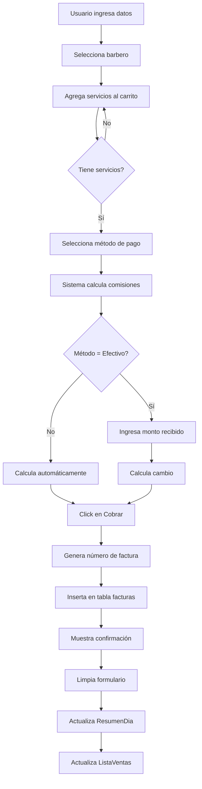

# 🏪 Sistema POS - Chamos Barber App

## 📋 Resumen

Sistema de Punto de Venta completo y funcional para gestionar ventas, comisiones y pagos en barberías. Desarrollado con Next.js, TypeScript y Supabase.

---

## 🎯 Estado Actual: MVP FUNCIONAL ✅

### ✅ Características Implementadas:

- **Registro de Ventas Walk-in**
  - Formulario completo de cobro
  - Carrito de compras multi-servicio
  - Múltiples métodos de pago
  - Cálculo automático de cambio (efectivo)

- **Sistema de Comisiones**
  - Cálculo automático por barbero
  - % configurable en base de datos
  - Desglose visual (barbero/casa)
  - Guardado en cada factura

- **Resumen en Tiempo Real**
  - Total de ventas del día
  - Monto total cobrado
  - Desglose por método de pago
  - Actualización automática

- **Historial de Ventas**
  - Últimas 20 ventas del día
  - Información completa
  - Filtrado por fecha
  - Actualización manual

- **Control de Acceso**
  - Sistema RBAC (admin, cajero, barbero)
  - Protección de rutas
  - Verificación de permisos
  - Redirección automática

---

## 🚀 Cómo Usar el Sistema POS

### 1️⃣ Acceso al Sistema

**Para Administradores:**
1. Login en `/login` con credenciales de admin
2. Click en botón "Abrir POS" en el header del panel admin
3. Acceso inmediato al sistema POS

**Para Cajeros:**
1. Login en `/login` con credenciales de cajero
2. Redirección automática a `/pos`
3. Acceso solo a funciones de cobro

### 2️⃣ Registrar una Venta

#### Paso 1: Información del Cliente
```
1. Ingresar nombre del cliente (requerido)
2. Ejemplo: "Juan Pérez"
```

#### Paso 2: Seleccionar Barbero
```
1. Seleccionar barbero del dropdown
2. Sistema cargará su % de comisión configurado
3. Ejemplo: "Gustavo Chamos - Experto en Cortes"
```

#### Paso 3: Agregar Servicios
```
1. Seleccionar servicio del dropdown
2. Click en "+ Agregar"
3. El servicio aparecerá en el carrito
4. Repetir para agregar más servicios
5. Mismo servicio = incrementa cantidad
6. Puede remover servicios con 🗑️
```

#### Paso 4: Seleccionar Método de Pago
```
Opciones:
- 💵 Efectivo (permite ingresar monto recibido y calcula cambio)
- 💳 Tarjeta
- 📱 Transferencia
- 💰 Zelle
- ₿ Binance
```

#### Paso 5: Cobrar
```
1. Verificar totales y comisiones
2. Click en "🖨️ Cobrar e Imprimir"
3. Sistema creará factura con número único
4. Mostrará alerta con número de factura
5. Formulario se limpiará automáticamente
6. Resumen y lista se actualizarán
```

### 3️⃣ Verificar Ventas del Día

**Panel Lateral Derecho:**
- Muestra total de ventas realizadas
- Muestra monto total cobrado
- Desglose por método de pago
- Se actualiza automáticamente tras cada venta

**Lista de Ventas:**
- Muestra últimas 20 ventas
- Información: Número, hora, cliente, barbero, total
- Click en "🔄 Actualizar" para recargar manualmente

---

## 👥 Credenciales de Acceso

### Usuario Cajero de Prueba:
```
Email:    cajero@chamosbarber.com
Password: Cajero123!
Rol:      cajero
Permisos: Cobrar, Cerrar caja (futuro)
```

### Usuario Admin:
```
(Usar credenciales existentes de admin)
Permisos: Acceso total al sistema
```

---

## 🗂️ Estructura de Archivos

```
src/
├── pages/
│   ├── pos.tsx                    # Página principal del POS
│   └── admin.tsx                  # Panel admin (con botón Abrir POS)
│
├── components/pos/
│   ├── CobrarForm.tsx             # Formulario de cobro (15 KB)
│   ├── ResumenDia.tsx             # Panel resumen del día (6 KB)
│   └── ListaVentas.tsx            # Lista de últimas ventas (5 KB)
│
├── hooks/
│   └── usePermissions.ts          # Hook para verificar permisos
│
└── lib/
    ├── permissions.ts             # Sistema de permisos
    ├── database.types.ts          # Tipos TypeScript
    └── supabase.ts                # Cliente Supabase
```

---

## 🗄️ Base de Datos

### Tablas Principales:

#### `facturas`
```sql
- id (UUID)
- numero_factura (VARCHAR) - Formato: F-YYYYMMDD-0001
- barbero_id (UUID)
- cliente_nombre (VARCHAR)
- items (JSONB) - Array de servicios
- subtotal, total (DECIMAL)
- metodo_pago (VARCHAR)
- monto_recibido, cambio (DECIMAL)
- porcentaje_comision (DECIMAL)
- comision_barbero, ingreso_casa (DECIMAL)
- anulada (BOOLEAN)
- created_at, updated_at (TIMESTAMP)
```

#### `configuracion_comisiones`
```sql
- id (UUID)
- barbero_id (UUID)
- porcentaje (DECIMAL) - Default: 50.00
- notas (TEXT)
- created_at, updated_at (TIMESTAMP)
```

#### `roles_permisos`
```sql
- id (UUID)
- rol (VARCHAR) - admin, cajero, barbero
- nombre_display (VARCHAR)
- permisos (JSONB)
- created_at (TIMESTAMP)
```

### Funciones SQL:

#### `generar_numero_factura()`
```sql
-- Genera número secuencial por día: F-20251109-0001
-- Se ejecuta automáticamente al insertar factura
```

#### `calcular_comisiones_factura(barbero_id, total)`
```sql
-- Retorna: { porcentaje, comision_barbero, ingreso_casa }
-- Consulta configuración del barbero o usa 50% default
```

### Vistas:

#### `ventas_diarias_por_barbero`
```sql
-- Resumen de ventas por barbero por día
-- Columnas: barbero_id, fecha, total_ventas, total_ingresos, etc.
```

#### `cierre_caja_diario`
```sql
-- Resumen de caja por método de pago
-- Columnas: fecha, metodo_pago, cantidad_transacciones, total_cobrado
```

#### `usuarios_con_permisos`
```sql
-- Join de usuarios con sus permisos completos
-- Usado por el hook usePermissions()
```

---

## 🔐 Sistema de Permisos

### Roles Disponibles:

#### 👑 Admin
```json
{
  "pos": { "cobrar": true, "anular": true, "cerrar_caja": true, "ver_reportes": true },
  "admin": { "ver": true, "editar": true, "eliminar": true },
  "configuracion": { "editar": true },
  "reportes": { "ver_todos": true, "exportar": true }
}
```

#### 💰 Cajero
```json
{
  "pos": { "cobrar": true, "anular": false, "cerrar_caja": true, "ver_reportes": false },
  "admin": { "ver": false, "editar": false, "eliminar": false },
  "configuracion": { "editar": false },
  "reportes": { "ver_todos": false, "exportar": false }
}
```

#### ✂️ Barbero
```json
{
  "pos": { "cobrar": true, "anular": false, "cerrar_caja": false, "ver_reportes": false },
  "admin": { "ver": false, "editar": false, "eliminar": false },
  "configuracion": { "editar": false },
  "reportes": { "ver_todos": false, "exportar": false }
}
```

---

## 📊 Flujo de una Venta



---

## 🎨 Capturas de Pantalla

### Vista del POS:
```
┌────────────────────────────────────────────────────────────┐
│ 🏪 CHAMOS BARBERÍA - POS    👤 Cajero    📅 09 Nov 2025    │
│ [← Admin] [🚪 Cerrar Sesión]                               │
├────────────────────────────────────────────────────────────┤
│                                                            │
│  FORMULARIO (70%)             │  SIDEBAR (30%)            │
│  ┌─────────────────────────┐ │  ┌─────────────────────┐  │
│  │  💳 Registrar Venta     │ │  │  📊 Resumen Día     │  │
│  │                         │ │  │                     │  │
│  │  👤 Cliente: [______]  │ │  │  Ventas: 8         │  │
│  │  ✂️ Barbero: [Gustavo▼]│ │  │  Total: $40.00     │  │
│  │  🛒 Servicio: [Corte ▼]│ │  │                     │  │
│  │      [+ Agregar]        │ │  │  💵 Efectivo: $30  │  │
│  │                         │ │  │  💳 Tarjeta: $10   │  │
│  │  ┌─ CARRITO ─────────┐ │ │  └─────────────────────┘  │
│  │  │ Corte Rapado $5  │ │ │                            │
│  │  │ TOTAL: $5.00     │ │ │  ┌─────────────────────┐  │
│  │  └──────────────────┘ │ │  │  📋 Últimas Ventas  │  │
│  │                         │ │  │  #23 $5.00 10:15  │  │
│  │  💰 Método: [Efectivo▼]│ │  │  #22 $8.00 10:05  │  │
│  │  💵 Recibido: $10.00   │ │  │  #21 $5.00 09:45  │  │
│  │  💵 Cambio: $5.00      │ │  └─────────────────────┘  │
│  │                         │ │                            │
│  │  📊 Comisión (50%):    │ │                            │
│  │  • Barbero: $2.50      │ │                            │
│  │  • Casa: $2.50         │ │                            │
│  │                         │ │                            │
│  │  [🖨️ Cobrar e Imprimir]│ │                            │
│  └─────────────────────────┘ │                            │
└────────────────────────────────────────────────────────────┘
```

---

## 🐛 Troubleshooting

### Error: "Rol no reconocido"
**Causa:** Usuario no tiene permisos para acceder al POS
**Solución:** Verificar que el rol sea 'admin' o 'cajero' en la tabla `admin_users`

### Error: "No se puede calcular comisión"
**Causa:** Barbero no tiene configuración de comisión
**Solución:** Insertar registro en `configuracion_comisiones` para ese barbero

### Error: "No se puede crear factura"
**Causa:** Falta algún campo requerido
**Solución:** Verificar que todos los campos obligatorios estén llenos (cliente, barbero, items)

### Página /pos no carga
**Causa:** Archivos no se desplegaron correctamente
**Solución:** Verificar que existan:
- `src/pages/pos.tsx`
- `src/components/pos/CobrarForm.tsx`
- `src/components/pos/ResumenDia.tsx`
- `src/components/pos/ListaVentas.tsx`

---

## 📈 Próximas Mejoras

### Pendientes (Prioridad Media):
- [ ] Componente `TicketPrint.tsx` para impresión térmica 80mm
- [ ] Modal `CerrarCaja.tsx` para cierre diario
- [ ] Sección "Usuarios" en admin panel para crear cajeros
- [ ] Búsqueda de citas existentes para cobrar
- [ ] Anular facturas (solo admin)
- [ ] Reportes de ventas por período

### Futuro (Prioridad Baja):
- [ ] Integración con impresora térmica directa (escpos)
- [ ] Exportar reportes a PDF/Excel
- [ ] Dashboard de ingresos con gráficas
- [ ] Configuración de comisiones desde UI
- [ ] Sistema de inventario
- [ ] Multi-tenant para múltiples barberías

---

## 🔗 Enlaces Útiles

- **Repositorio:** https://github.com/juan135072/chamos-barber-app
- **Documentación Completa:** `/docs/PROGRESO_SESION_POS.md`
- **Guía de Migraciones:** `/docs/MANUAL_MIGRATION_GUIDE.md`
- **Crear Usuarios Cajero:** `/docs/CREAR_USUARIO_CAJERO.md`

---

## 📞 Soporte

Para dudas o problemas:
1. Revisar documentación en `/docs/`
2. Verificar logs en consola del navegador
3. Verificar logs de Supabase
4. Crear issue en GitHub

---

**Desarrollado con ❤️ para Chamos Barber App**  
**Versión:** 1.0 MVP  
**Última actualización:** 2025-11-09
